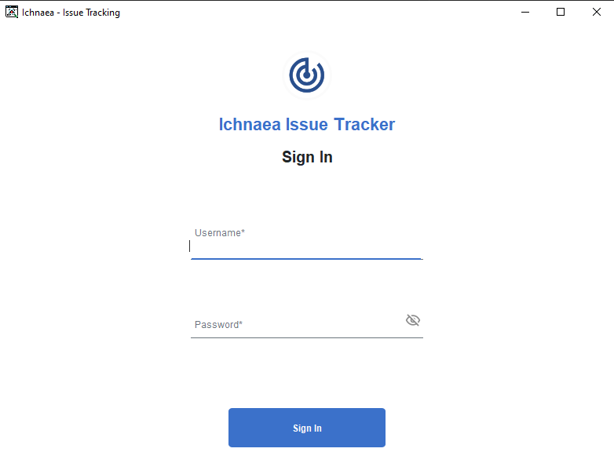
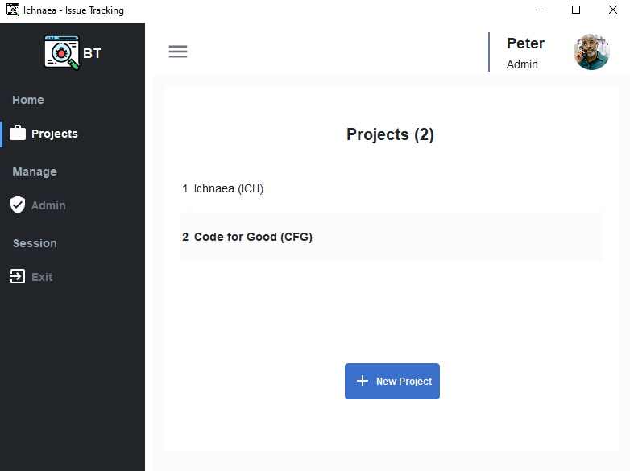
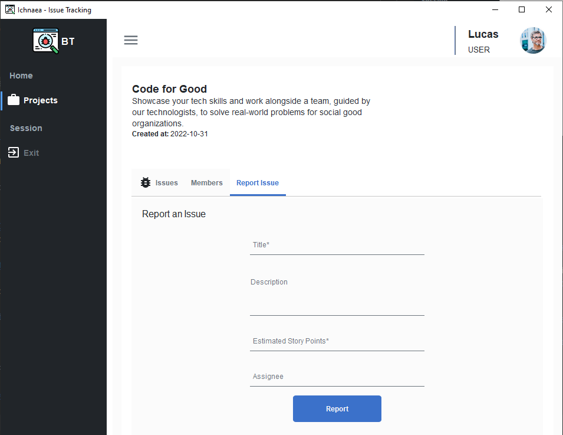

# Ichnaea Issue Tracker

    

Named after the greek goddess [Ichnaea](https://en.wikipedia.org/wiki/Ichnaea), "_The Tracker_", is a **Java**
application
for **issue tracking**. It is designed to be used by
Project Managers
and Developers to track
issues and their status in multiple projects.

## Project Requirements

### Develop a Bug tracker

An incident tracking system should be created, similar to the classic Bugzilla or MantisBT.

### Basic features

#### Users and Profiles.

The application must be able to manage users, each with different permissions: report an issue, change its status,
indicate the time spent, close it, etc.

An admin user will be responsible for managing the users and their permissions, will be able to create new projects.
Non-admin user will only be able to report issues, change their status and create new ones.

#### Projects

The application must be able to manage N projects, each with different users and permissions, and multiple issues.

#### Issues

It should be possible to create issues, assign them to a user, change their status, indicate the time spent. An Issue
should have a description, a status, a title, a priority and real time spent, a list of comments, etc.

### Advanced features

#### Historical

The application must be able to show the history of the changes made to an issue, and who made them.

#### Reports

Each project should have a report that shows the issues with their estimated time vs real time spent.

It should be possible to showcase which projects are the most delayed, which ones are the most advanced. How many issues
are in each status, How many hours are spent in each status. Only the admin user should be able to see this report.

### Extra features

#### Historical

Historical on issues changes on both status and comments should be shown in a timeline (chronological order), and be
shown in an issue detail page.

## Preview

### Log In View

### Home

### Project Details View

## Credits

This project was made with 💙 by [Tomas Sanchez](https://github.com/tomasanchez).

Special thanks to [DJ-Raven](https://github.com/DJ-Raven) as his work inspired the different UI elements, most of the
components' logic was developed for his [raven-project](https://github.com/DJ-Raven/raven-project) , where I merely
adapted it to my needs and implemented on
Kotlin.

UI elements were inspired by [Material Design](https://material.io/design/).
And [Bootstrap 5](https://getbootstrap.com/docs/5.0/getting-started/introduction/) looks and feels.

MVC logic is based on my previous [jpa-template](https://github.com/tomasanchez/jpa-template) project, which
itself was based
on [SpringBoot](https://spring.io/projects/spring-boot).

<a href="https://www.flaticon.com/free-icons/bug" title="bug icons">Bug icons created by Freepik - Flaticon</a>

## License

All material is provided under Mozilla Public License unless otherwise specified.

Mozilla Public License can be found at <https://www.mozilla.org/en-US/MPL/2.0/)> or see the [`LICENSE`](LICENSE) file.